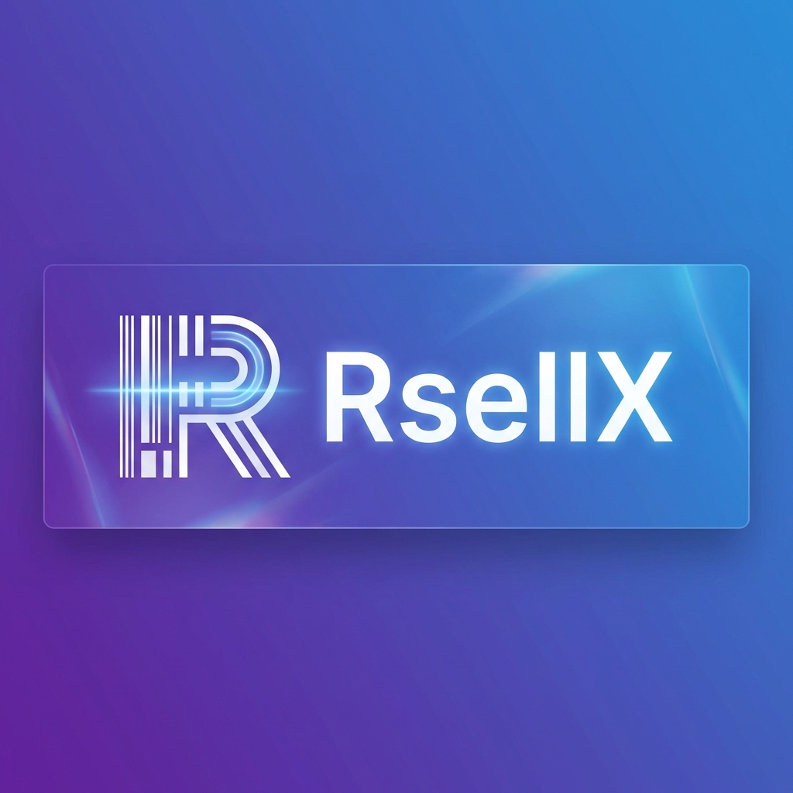
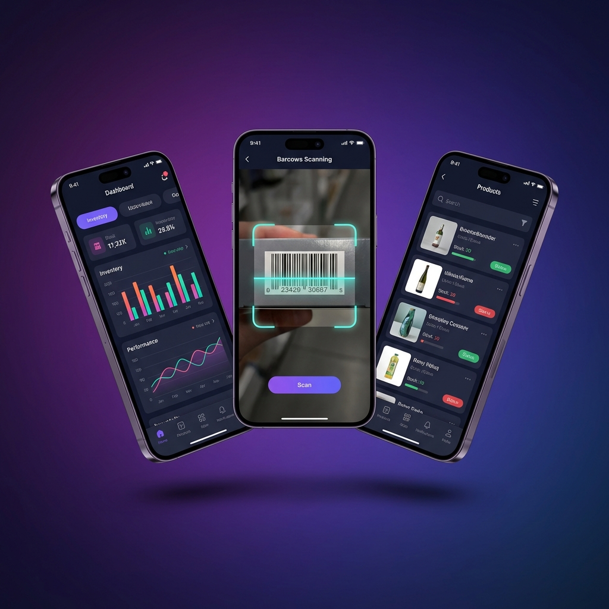

<div align="center">

# 📦 RsellX



### 🏪 **Professional Barcode Inventory Management System**

*A powerful, offline-first Flutter application for managing your crockery shop inventory with advanced barcode scanning, sales tracking, and comprehensive reporting.*

[](https://flutter.dev)
[](https://dart.dev)
[](LICENSE)
[]()

---

</div>

## 📱 App Preview

<div align="center">

</div>

---

## ✨ Features

<div align="center">

</div>

### 🔍 **Smart Barcode Scanning**
- Lightning-fast barcode scanning using device camera
- Support for multiple barcode formats (EAN-13, EAN-8, UPC, QR Code)
- Instant product lookup and automatic form filling
- Audio feedback on successful scans

### 📊 **Complete Inventory Management**
- Add, edit, and delete products with ease
- Track stock levels in real-time
- Low stock alerts and notifications
- Product categorization and filtering
- Image support for each product

### 💰 **Sales & Transactions**
- Quick POS-style checkout system
- Shopping cart functionality
- Sales history and transaction tracking
- Daily, weekly, and monthly sales analytics

### 💳 **Credit Management**
- Customer credit tracking
- Payment history management
- Outstanding balance alerts
- Customer-wise reports

### 📑 **Professional Reports**
- Generate PDF invoices and reports
- Export data to Excel spreadsheets
- Share reports via email or messaging apps
- Customizable report templates

### 💼 **Expense Tracking**
- Record business expenses
- Categorize spending
- Expense analytics and trends
- Profit/Loss calculations

### ⚙️ **Additional Features**
- 🌙 Beautiful Material Design UI
- 📴 Fully offline capable (Hive database)
- 🔄 Data backup and restore
- 🔐 Secure local storage
- 📱 Cross-platform (Android, iOS, Windows)

---

## 🛠️ Tech Stack

| Technology | Purpose |
|------------|---------|
| **Flutter** | Cross-platform UI framework |
| **Dart** | Programming language |
| **Hive** | Fast, lightweight NoSQL database |
| **Provider** | State management |
| **Mobile Scanner** | Barcode scanning functionality |
| **PDF/Printing** | Report generation |
| **Excel** | Spreadsheet export |
| **Google Fonts** | Beautiful typography |

---

## 🚀 Getting Started

### Prerequisites

- Flutter SDK 3.10 or higher
- Dart SDK 3.0 or higher
- Android Studio / VS Code
- Git

### Installation

1. **Clone the repository**
   ```bash
   git clone https://github.com/yourusername/rsellx.git
   cd rsellx
   ```

2. **Install dependencies**
   ```bash
   flutter pub get
   ```

3. **Generate Hive adapters** (if needed)
   ```bash
   flutter packages pub run build_runner build
   ```

4. **Run the app**
   ```bash
   flutter run
   ```

---

## 📁 Project Structure

```
lib/
├── core/                # Core utilities, theme, services
│   ├── services/        # Database, logger, etc.
│   ├── theme/           # App theming
│   └── utils/           # Helper functions
├── data/                # Data models and repositories
├── features/            # Feature modules
│   ├── barcode/         # Barcode scanning
│   ├── cart/            # Shopping cart
│   ├── credit/          # Credit management
│   ├── dashboard/       # Main dashboard
│   ├── expenses/        # Expense tracking
│   ├── history/         # Transaction history
│   ├── inventory/       # Inventory management
│   ├── settings/        # App settings
│   └── splash/          # Splash screen
├── providers/           # State management (Provider)
├── shared/              # Shared widgets and components
└── main.dart            # Application entry point
```

---

## 🖼️ Screenshots

| Dashboard | Inventory | Barcode Scanner |
|:---------:|:---------:|:---------------:|
| 📊 Analytics & Stats | 📦 Product List | 🔍 Scan Products |

| Sales History | Reports | Settings |
|:-------------:|:-------:|:--------:|
| 💰 Transaction Log | 📑 PDF/Excel | ⚙️ Configuration |

---

## 🤝 Contributing

Contributions are welcome! Please feel free to submit a Pull Request.

1. Fork the project
2. Create your feature branch (`git checkout -b feature/AmazingFeature`)
3. Commit your changes (`git commit -m 'Add some AmazingFeature'`)
4. Push to the branch (`git push origin feature/AmazingFeature`)
5. Open a Pull Request

---

## 📄 License

This project is licensed under the MIT License - see the [LICENSE](LICENSE) file for details.

---

## 👨‍💻 Author

**Your Name**

- GitHub: [@yourusername](https://github.com/yourusername)
- LinkedIn: [Your LinkedIn](https://linkedin.com/in/yourprofile)

---

<div align="center">

### ⭐ Star this repo if you find it useful!


---

*Made with ❤️ and Flutter*

</div>
